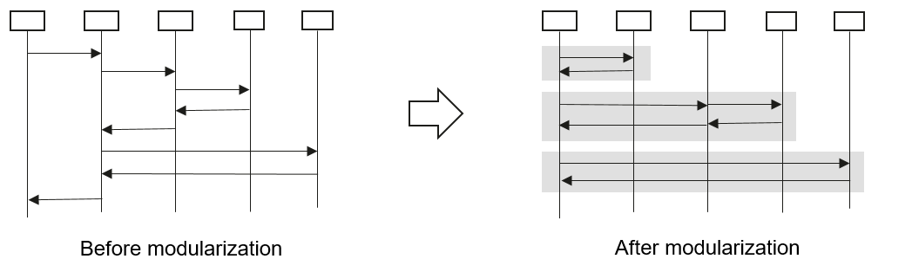
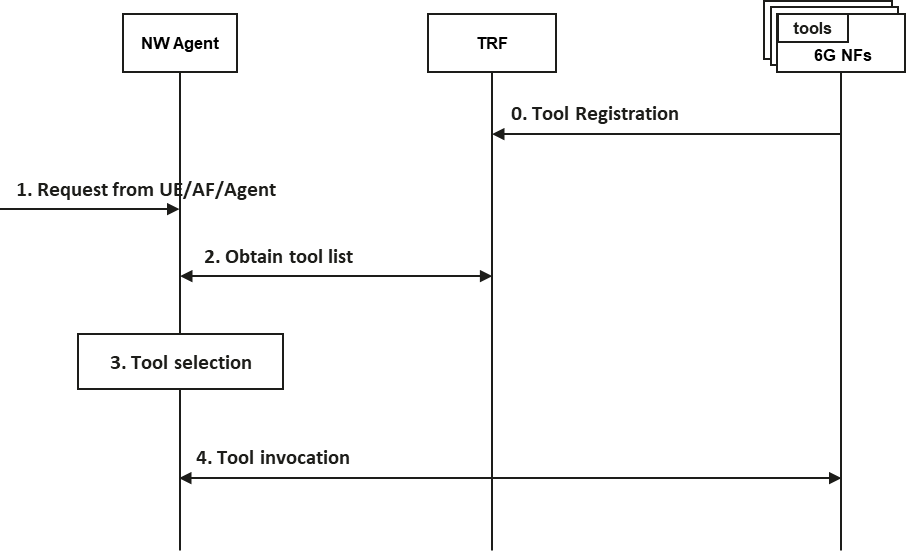
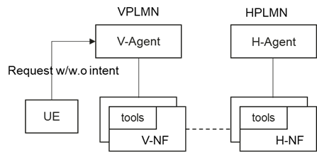
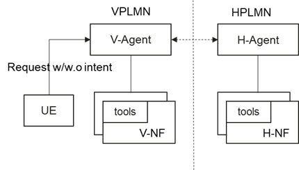

**3GPP TSG-WG SA2#174 S2-2602109**

**Malta, 13 – 17 April 2026 (revision of S2-2600182)**

**Source: Huawei, HiSilicon**

**Title: [KI#18, Updated] New Solution of Agentic Core Architecture**

**Document for: Approval**

**Agenda item: 20.6.18**

**Work Item: FS_6G_ARC**

*Abstract of the contribution: The document proposes a novel Agentic architecture designed to leverage AI agent for enabling dynamic, flexible request handling.*

# 1. Introduction

This solution proposes network AI Agents into 6GC as new AI capable entities, which are inherently capable of handling highly complex and dynamic consumer service requirements. In particular:

- Instead of invoking single-feature based procedures or API calls, network AI Agents can consolidate various network capabilities and resources, models and applications to execute complex tasks;

- Agents can provide customized services based on user’s request, which is flexible and highly adaptable, making the network easy to use;

- Agents can make run-time adjustment for providing the best service experience anytime, anywhere by perceiving the network environment and service conditions through self-optimization, self-reflection;

- Agents can dynamically learn to leverage tools to influence the network, and with appropriate modularization of network functionalities, an agentic approach enables rapid service innovation, shortens time‑to‑market for new features, and minimizes disruption to existing network functions.

The solution covers the following aspects:

- provides a high‑level summary of the proposed solutions, outlining the key principles and fundamental assumptions.

- introduces the proposed agentic core architecture, describes each entity, and explains how these entities interact to operate as a cohesive system.

- elaborates the multiple network AI agents used in 6GC.

- presents a modeling approach for network capabilities as tools that the network AI agent can invoke to fulfill requests from the UE or AF.

- defines and explains how intents can be expressed and delivered to the AI agent, and describes how the network AI agent interprets and handles them.

- explains Agentic core architecture in roaming scenarios.

- illustrates how Network AI agent can leverage closed-loop mechanism for self-learning and self-optimization.

| Aspect | Covered by the solution |
| --- | --- |
| **0 General principles and assumptions** |   |
| 0.1 Terminology |   |
| 0.2 KI Notes 1-12 |   |
| *0.3 Other aspects* |   |
| **1 Handling requests including intent** | Yes |
| 1.1 High-level architecture | Yes |
| 1.2 Intent delivery | Yes |
| 1.3 Intent fulfilment | Yes |
| 1.4 Intent description/structure | Yes |
| 1.5 Roaming | Yes |
| 1.6 5G AI interoperability |   |
| *1.7 Other aspects* |   |
| **2 Handling requests without intent** | Yes |
| 2.1 High-level architecture | Yes |
| 2.2 Request fulfilment | Yes |
| 2.3 Roaming | Yes |
| 2.4 5G AI interoperability |   |
| *2.5 Other aspects* |   |
| **3 AI-capable NF** |   |
| 3.1 Enable AI model provisioning, inferencing, training, monitoring for AI-capable NFs |   |
| 3.2 Learning techniques |   |
| 3.3 Roaming |   |
| 3.4 5G AI interoperability |   |
| *3.5 Other aspects* |   |
| **4 AI capability access (if applicable)** |   |
| 4.1 Access AI capabilities provided by 6G NFs |   |
| 4.2 Access trusted external capabilities provided by AF |   |
| *4.3 Other aspects* |   |
| **5 Performance monitoring** | Yes |
| 5.1 Monitoring of the performance of all AI capable entities in 6G CN |   |
| 5.2 Closed-loop operation | Yes |
| *5.3 Other aspects* |   |
| **6 Operator control** |   |
| 6.1 Operator to control the network's use of AI capabilities in its 6G CN |   |
| *6.2 Other aspects* |   |
| **7 Other aspects** |   |
| *7.1 Other aspects* |   |

Table : Mapping of Categories for Solutions to Key Issue#18

Compare with S2-2600182, in this contribution we add details about how tools are registered and discovered by the NW agents, signalling design for communications between pair of NW agents, architecture support for roaming scenario and closed-loop operations.

# 2. Text proposal

It is proposed to agree the following changes vs. TS 23.801-01:

* * * First Change * * * *

## 6.0 Mapping of Solutions to Key Issues

*Guidance – Fill out the table describing how the solutions map to KIs*

Table 6.0-1: Mapping of Solutions to Key Issues

|   | Key Issues |   |   |   |   |   |   |   |   |   |   |   |   |   |   |   |   |   |   |
| --- | --- | --- | --- | --- | --- | --- | --- | --- | --- | --- | --- | --- | --- | --- | --- | --- | --- | --- | --- |
| Solutions | #18 | #Q |   |   |   |   |   |   |   |   |   |   |   |   |   |   |   |   |   |
| #X |   |   |   |   |   |   |   |   |   |   |   |   |   |   |   |   |   |   |   |
| #Y | X |   |   |   |   |   |   |   |   |   |   |   |   |   |   |   |   |   |   |

* * * Next Change * * * *

## 6.18 Solutions to KI#18

*Guidance: a proposed solution can address a KI, a subset of a KI, multiple KIs, or subsets of multiple KIs.*

### 6.18.Y Solution #18.Y: New Solution of Agentic Core Architecture

#### 6.18.Y.0 Topics addressed and High-level Solution Principles

This document aims to address the following KIs, i.e., KI#18 (specifically bullet 1, 2, 3, 4):

1. Enable the 6G CN to leverage AI capabilities and technologies in the 6G CN (e.g. AI agent), subject to operator policies and configuration and using 6G CN functionalities available in the network:

a) Determine how to fulfil requests from the UEs or AFs when intent is included and, in order to ensure interoperability of intents and supporting system test cases, determine the constraints on the use and expression of intents sent from the UEs and the AFs so that the intents can be processed and interpreted unambiguously by the AI capable entities in the 6G CN, and define the mechanisms required to support these constraints.

b) Determine how to fulfil requests when intent is not included.

c) In order to enable AI capable entities in 6G CN to dynamically compose parts of procedures to fulfil requests from UEs and AFs, determine the design principles and constraints for the modularisation of the procedures for the 6G CN that will be applicable to the system procedures defined in the normative work. How to enable the AI capable entities to compose these procedures in SA2 specifications will be determined by the study.

2. Enable closed-loop operations and learning techniques such as reinforcement learning, in 6G CN.

3. Enable entities in 6G CN to access network AI capabilities provided by 6G NFs.

4. Enable AI capable entities in 6G CN to access trusted external capabilities provided by AF.

We argue that Network AI agent (NW-Agent) can inherently address the aforementioned issues. A network AI agent is an automated intelligent entity in 6G core network capable of e.g., intent understanding, awareness of network status and contextual information, task decomposition and orchestration, tool invocation, self-learning and self-optimization, to fulfil the specific requirements from UEs/AFs.

In order to fully exploit AI‑agent capabilities in the 6G network, we propose an agentic core architecture in which Network AI Agents collaborate to fulfil diverse service requests by leveraging network capabilities modelled as tools. To address intent interoperability, the solution further specifies how intents can be expressed and conveyed to the AI agent, as well as how the Network AI Agent interprets and processes these intents.

The **high-level principles** of the solutions can be outlined as the following:

**High Level Solution Principles:**

- Network AI Agents (NW‑Agents) are defined as functional entities responsible for handling service requests originating from the UE or AF. NW‑Agents interpret the request, determine the required actions, and leverage necessary tools, see Clause 1.3, to fulfil it.

- Requests from UE or AF include the requests with intent and the requests without intent.

- Requests from UE are transferred via control plane signaling (i.e. 6G NAS). Requests from AF will be transferred via 6G NEF.

- NW‑Agents make use of tools to query, control, or influence the network. These tools include capabilities provided by the 6G NFs and external capabilities provided by 6G AFs. NFs are expected to provide such tools so that NW‑Agents can access their capabilities in a controlled and interoperable manner.

NOTE 1: Agent-Tool approach is used to address bullet 1 (including sub-bullets a, b, c) and bullet 2, 3, 4 in KI#18.

- Tools are only visible to the NW-Agents

- We propose semi-structured intent definition approach. Intent from UE or AF to the 6G CN should include standardized information fields to ensure consistent interpretation. At the same time, the framework should allow flexible, natural‑language descriptions so that additional contextual information can be conveyed when needed. This enables both interoperability and extensibility in intent handling.

NOTE 2: This principle addresses sub-bullet 1a and NOTE 3 in KI#18.

- Handling of intents should comply with network policies, subscription constraints, and network resource limitations. This ensures that intent fulfilment remains predictable, secure, and aligned with operator governance.

NOTE 3: This principle addresses portion of sub-bullet 1a in KI#18, regarding determine the constraints on the use and expression of intents.

- In roaming scenario, the following principles are applied:

- NW-Agents in the VPLMN handles the request (with or without intent) from UE

- NW-Agents in the VPLMN leverage tools or coordinate NW-Agents in the HPLMN to fulfil the request from UE

**Solution Assumptions:**

The propose solution are based on the following assumptions:

- UE requests are transferred via NAS, which may or may not include intent.

- The network is responsible for interpreting UE request (with or without intent) by leveraging NW-Agent.

- The MT stack of UE is assumed to be agnostic to whether or not the network uses 6G CN AI capable entities (e.g. AI agent, AI-enabled NFs) to address UE requests not including intent.

#### 6.18.Y.1 Description

#### **0 General principles and assumptions**

#### 0.0 General description

[Description]

*Guidance – include in this clause a note stating whether and how the solution makes use of AI to fulfil KI#18.*

#### 0.1 Terminology

*Guidance – please use the following terminology whenever possible. However, you can use this clause to include additional terms beyond the following terms, or propose changes to these terms:*

*AI-capable entity: any entity in the 6G CN that has AI capabilities (agentic or not)*

*agentic entity: entity in the 6G CN that has agentic capabilities (a sub-category of AI-capable entities)*

*6G CN NF: any NF of the 6G CN.*

*AI-capable 6G CN NF: 6G CN NF that has AI capabilities ( whether agentic or non agentic) (a sub-category of AI-capable entities)*

*non-AI-capable 6G CN NF: 6G CN NF that does not have any AI capabilities*

[Description]

#### 0.2 KI NOTEs 1-12

[Description]

#### 0.3 Other aspects

[Description]

#### **1 Handling requests including intent (#1.a & # 1.c)**

#### 1.0 General

#### 1.1 High-level architecture

**Figure 6.18.Y.1-1 Control Plane of Agentic Core Architecture**

As shown in Figure 6.18.Y.1-1, the main components of the agentic core architecture include:

- **Network AI agents (NW-Agents)**: An network AI agent is an dedicated NF with Agentic functionality in 6G core network capable of e.g., intent understanding, awareness of network status and contextual information, task decomposition and orchestration, tool invocation, self-learning and self-optimization, to fulfil the specific requirements from UEs and from AFs. There could be multiple Network AI agents (e.g., Planning Agents, Connection Agent, Computing Agent, Data Agent, etc) in the architecture with different functionalities or capabilities. When multiple types/instances of agents are deployed in the network, to support agent discovery and selection, ARF (Agent Repository Function) is introduced. Clause 1.1.1 provides more details about multi-agent architecture.

- **SRF** (Signalling Routing Function): SRF is responsible for receiving request (with or without Intent) from UE and routing the request to the corresponding Network AI agents, according to the routing rules.

NOTE 1: Control Plane message routing details are shown in the solutions for KI#1.

- **Tools:** Tools are capabilities that NW‑Agents invoke to complete their planned tasks, such as obtaining network information, setting up user‑plane resources, configuring network entities, or performing data computation. Tools are exposed by NFs or other network components through controlled interfaces suitable for AI‑driven invocation. A tool may encapsulate function of a single NF, or it may combine functions across multiple NFs which involves inter-NF service invocations. The agent may additionally access external capabilities through tools exposed by an AF. Tools can also be customized and dynamically provisioned in the network.

In order to support dynamic tool discovery and selection, TRF (Tool Repository Function) is proposed. Clause 1.3.2 provide more details about tool definitions and invocations.

Figure 6.18.Y.1-2 illustrates basic behaviors of Network AI Agents for handling UE/AF requests.

**Figure 6.18.Y.1-2 Generic Illustration of Interaction between Network AI agents and tools**

1, NW-Agent receives request from UE or from AF.

2, NW-Agent checks if the request can be fulfilled based on the network condition, variety of constraints (details will be shown in clause 1.4.2), as well as the available tools. If the request cannot be fulfilled, the UE/AF will be informed.

3, If the request can be fulfilled, the agent determine an ordered plan of tasks. These tasks may be executed by the agent itself, by invoking a tool, or by delegating to other agents. In the figure, only the case where tasks are completed via tools is illustrated. The multiagent scenario is described in Clause 1.1.1.

4, According to the plan, NW-agent calling different tools to complete different tasks. How the tools are defined, how to discover and select the tools will be discussed in Clause 1.3.

5, NW-Agent perceive the conditions of UE, network, applications, etc and determine if plan should be updated or it should continue to serve the request. For example, the request is already fulfilled, or some condition is reached, so that the request will not be further served.

6, If the request should be still served, the step 3 to 5 repeat. Otherwise, the service is terminated.

##### Multiple Agents

Similar as network functionality partition, multi-agent system has the following advantages compared with single agent system:

- Domain-specialized ability: Each agent only needs to handle tasks within a specific domain, perceiving and invoking tools and knowledge specific to that domain to improve the accuracy of task execution. Domain-specific capabilities allows the system to scale more conservatively based on needs, by only increasing the resources for the subsets that need more capacity.

- Easy evolution and vendor diversity: By decoupling the functions of different agents, new agent capabilities can be introduced to support emerging demand scenarios with minimal impact on existing agents, ensuring strong scalability. This modularity also enables operators to deploy and integrate functionalities specific to their network needs, with the support of vendor innovation.

Based on the principles above, this solution initially proposes the following Network Agents within the agentic core architecture as a starting point, with the expectation that the role of various agent could be adjusted as the study progresses:

**Figure 6.18.Y.1-3: Multiple types of Network AI Agents.**

- **Planning Agent**

Planning Agent is acting as the leading agent to coordinate other Network AI agents to fulfill the service requests. The main functions of planning agent include:

- Understand the service requests and analyze user requirements, verify the network constraints, evaluate the feasibility and potential risks based on internal model, operator service policy, service guideline and network conditions etc.

- Decompose the service request into manageable and executable subtasks and composes the corresponding dynamic workflow or procedures.

- Coordinate with other network entities (e.g., NW-Agents) and tools to fulfill the service requests.

- Control and manage the task‑execution process by monitoring the progress of each assigned subtask, updating the execution plan as needed, and optimizing workflows based on real‑time execution status.

- **Connection Agent**

Connection Agent is responsible for fulfilling the connection services request or tasks, providing tailored connection services and experience guarantee, leveraging appropriate tools to fulfil connection‑related service request or tasks. The main functions of connection agent include:

- Understand connection related requests.

- Provide proactive, seamless, personalized and service-aware connection assurance, deliver differentiated runtime experience guarantees per UE, session or flow, adapting to real-time network conditions, historical behavioral patterns, individual preference profiles, etc.

- Trigger standardized procedures or compose of dynamic procedures based on new NFs/network capabilities, and insert or replace part of the standardized procedures to provide tailored connection services for users.

- Control and manage task execution by monitoring subtask progress and the resulting connection‑service experience, update workflows and adjust network parameter configurations in real time, if needed.

**- Data Agent**

Data Agent is responsible for fulfill data‑related service requests or tasks, providing efficient, secure, and context‑aware data handling and provisioning within the 6G Core, leveraging appropriate tools to fulfil data‑related service request or tasks. The main functions of data agent include:

- Understand data related requests.

- Perform dynamic schedule, configuration, and execution of data‑handling tasks. For example, the Data Agent may translate an intent‑based query into an ordered sequence of data‑handling operations with deterministic QoS requirements, such as data collection, data processing, data transformation, and data distribution.

- Exposes data to external entities when authorized.

- Invokes 6G network internal CN NFs as tools or resources, and collaborates with the data framework, to be defined in KI#21, to ensures that data operations are executed efficiently, adhere to operator policies, and meet the required performance and security constraints.

- **Computing Agent**

Computing Agent is responsible for fulfill computing‑related service requests or tasks, providing tailored computing services and experience guarantee, leveraging appropriate tools to fulfil computing‑related service request or tasks. The main functions of computing agent include:

- Understand computing related requests.

- Select appropriate tools required for each computing service task, e.g., dynamically determine and prepare the execution host environment, setup user plane for traffic associated with the computing service.

- Determine the necessary computing‑service input parameters, such as required computing resources, based on the user request or intent.

- Throughout execution, it monitors and manages the computing task, dynamically adjusting or optimizing computing requirements and parameters based on real‑time execution status to ensure efficient and reliable completion of the computing service.

NOTE 1: In KI#18, it is expected that we will define generic NW-agent functionality, tool definitions, intent definitions. Regarding service-specific agents, e.g., data agent, computing agent, they will be proposed as solutions in the related KIs on how to leverage AI agent technology to help fulfilling data and computing related requests.

The interactions among multiple agents are illustrated in Figure 6.18.Y.1-4. The Planning Agent allocates subtasks to the appropriate Network Agents (NW‑Agents) based on their capabilities and provides each of them with the corresponding task information. After receiving their assignments, the NW‑Agents execute their respective tasks and report status updates and progress information back to the Planning Agent as required.

Throughout the process, the Planning Agent continuously monitors the reported task status, as well as relevant network and UE conditions. Based on this ongoing feedback, it may refine the task allocation, adjust the execution plan, or trigger additional subtasks to ensure that the overall intent can be met. By aggregating and interpreting the progress from the involved NW‑Agents, the Planning Agent derives the overall service outcome associated with the original request.

Through this dynamic and adaptive coordination, the Planning Agent enables cross‑entity collaboration within the 6GC, supporting capabilities such as network self‑optimization, intent‑driven orchestration, and end‑to‑end service‑experience assurance.

**Figure 6.18.Y.1-4: Illustration of interaction among Multi-Agent to serve service request.**

#### 1.2 Intent delivery

Intent-based communication between UE and the Network AI Agent is supported by encapsulating the intent in NAS signalling, e.g., within a new type NAS Container. The general procedure can be illustrated as the following figure.

UE-initiated NAS request messages (with or without the intent included) are always first forwarded to the NW-Agent. It is assumed that there is a new NAS message type, e.g., called Type Intent, to convey Intent from UE to network. The SRF can send the Intent Type NAS message to a planning agent based on the message type. Upon receiving the message, the planning can understand the intent, conduct task composition and dynamic composition of procedures. Other options may be also possible, e.g., Intent is piggybacked with existing type of NAS message.

It is assumed multiple types/instances of Network AI Agents are deployed in the network. Different NW-Agents are responsible for the handling of different service requests, for example, the connection agent handles connectivity service (e.g., access management service, session management service), while data agent and computing agent manage data service and computing service respectively. After understanding the intent and planning the tasks, the planning agent can interact with these service-specialized NW-Agents to complete the tasks. The AI capabilities of the NW-Agents are also applicable to process UE request without intent. Therefore, legacy NAS request messages without intent included can be directly routed to the corresponding agents.

**Figure 6.18.Y.1-5: UE request delivery to NW Agents**

When Intents are from AF, 6G NEF (Network Exposure Function) is responsible for identifying and forwarding the intents in the requests to the dedicated Agent for the intent handling in 6G CN. Regarding the AF request without intent, it will be discussed in KI#7. If there is AI Agent in AF and interact with 6G CN with Agent-to-Agent protocol, then the request will be handled by NW-Agent. How AI Agent in AF interacts with NW-Agent is discussed in KI#19.

#### 1.3 Intent fulfilment

In 5GS, the network procedures are defined with procedural pattern, characterized by end-to-end, "hardcoded" call flows. This design specifies every signaling step between Network Functions (NFs) in a rigid, chronological sequence.

The primary drawback of this approach is its rigidity. Because the steps are tightly coupled, modifying a single stage often requires changes to other steps as well. This leads to difficulty in scaling specific functions independently, and more and more complex E2E procedures when more features are introduced into the network.

Transitioning to a Modular and Programmable Flow is essential to unlock network agility. By deconstructing these service procedures or functionalities as reusable “tools”, the service procedure can become flexible (e.g. to "plug and play" specific functionality without disrupting the whole sequence) and programable by NW-Agents. Figure 6.18.Y.1-6 illustrates the modularization approach.

**Figure 6.18.Y.1-6 Procedure Modularization. Each shadowed box in right hand-side represents an identified modularized functionality.**

In our proposal, we adopt a modularized approach to balance the functionality boundary between NW AI agents and NFs. In particular, we try to identify key functionality modules and define them as tools. By invoking these tools, NW‑Agents can reason, plan, and orchestrate services without directly manipulating network resources. This preserves a clean separation between AI‑driven decision‑making (performed by the agent) and deterministic network operations (performed by NFs).

A 6G Network tool is a capability exposed by a Network Function (NF) or other network component through a controlled interface suitable for AIdriven invocation. Tools may wrap SBA services, expose a subset of an NF’s internal functionality, or provide operatorspecific or vendorspecific capabilities. Tools can also be customized and dynamically provisioned within the network as needed.

NOTE: The tool examples shown in clause 1.3 are not intended to prescribe the final set or granularity of the modularization. The actual level of decomposition—whether broader or more fine‑grained—will be refined as the study progresses.

##### 1.3.1 Templates of Tools

To represent network capabilities in a consistent and interoperable manner, we define a tool definition template that captures the essential characteristics of the identified modules when modeled as tools. This template ensures that Network AI Agents can understand how to invoke a tool and what effects its invocation will have on the network:

**Tool Definition template:**

- **Name:** Name of the tool.

- **Purpose:** The most important information. A concise description of what the tool enables the NW‑Agent to achieve, including the specific UE or network states it can observe, modify, or influence; this information guides the NW‑Agent in selecting the tool that aligns with its goal.

- **Description:** Provides a clear explanation of the tool’s purpose, its expected behavior, and how it should be used by NW‑Agents.

- **Hosting NF:** Identifies the 6G Network Function that provides and executes the tool.

- **Pre-condition**: Defines the conditions that must be satisfied before the tool can be invoked (e.g., UE state, session state, resource availability).

- **Input:** Specifies the information or parameters required to invoke the tool.

- **Output:** Describes the information returned by the tool upon completion.

- **Post-condition:** Describes the resulting state or conditions after the tool has completed its operation.

- **Procedures **(if applicable): Outlines the sequence of actions performed from the moment the Host NF receives the tool invocation until the tool completes its operations. This may include internal NF logic, interactions with other NFs, or updates to network state.

##### 1.3.2 Tool Registration, Discovery and Communication

NW‑Agents require sufficient information about available tools in order to determine which tool to invoke and how to invoke it correctly. This includes understanding a tool’s purpose (e.g., through its name and description), its expected input parameters, its outputs, and the network conditions or UE context that the tool may modify.

To support this, we propose introducing a **Tool Repository Function (TRF)** within the 6GC. The TRF manages tool‑related information and enables standardized mechanisms for tool registration and discovery:

- Registration: The TRF supports tool registration, allowing each tool to provide descriptive information so that NW-Agents can understand whether and how the tool should be used. The TRF stores and maintains this information, which may include the tool name, description, input and output schema, and other information defined in clause 1.3.1.

- Discovery: TRF supports tool discovery procedure, where a NW-Agent sends a tool discovery request to the TRF. Upon the reception of a tool discovery request, TRF returns a list where each item contains tool information about an already registered tool.

Compared with the registration/discovery/selection of NF services, which is exact parameter matching, the introduction of tools supports the mechanism of semantic-based registration/discovery/selection. Figure 6.18.Y.1-7 shows the procedure for tool registration/discovery/selection.

**Figure 6.18.Y.1-7: Procedure of tool registration, discovery and selection.**

0. 6G NFs (as hosting NFs of tools) register available tools to TRF. Tool Registration request includes tool information such as Tool Name, Hosting NF info (NF instance ID and NF address), Purposes, Description, Inputs, Outputs, Pre-condition and Post-condition, as defined in clause 1.3.1.

1. NW-Agent receives request from UE, AF or other NW-Agents.

2. The NW-Agent requests tool information from TRF. TRF provides requested tool information to the NW-Agent, which includes semantic information, for example, tool description and the description of input/output parameters, so that the NW-Agent can understand how to select the appropriate tools and invoke these tools. Step may happen before step 1.

3. The NW-Agent selects target tool(s) based on the tool information from TRF.

4. The NW-Agent sends tool invocation request to corresponding hosting NF(s). The invocation request includes input parameters generated by the NW-Agent based on the tool information (e.g., the description of input parameters). The hosting NF executes the procedure corresponding to the tool based on the tool request, and sends the tool execution results to the NW-Agent. When and which tool should be invoked is according to the NW-agent planning, which is based on the consumer request, tool invocation pre-conditions, the capability of the NW-Agent (e.g., which tool it can leverage, autonomy mode that described in Clause 6).

##### 1.3.3 Access and Mobility Management Related Tool Examples

In this clause, we will show how NW-Agent handles UE registration request, i.e., request without intent, by leverage a set of tools as examples. Through the example, we can see how NW‑Agent can adapt network behaviours to different UE types and mobility patterns, which is barely possible within rigid, procedure‑driven architectures.

Access and mobility management encompasses a set of interdependent functionalities that collectively ensure secure access, mobility handling, and reachability tracking for the UE:

**- The network should determine whether a UE is permitted to access the network.** This requires establishing the UE’s legitimacy, which is usually done by UE Authentication.

**- UE should be authorized according to its subscription data**. Authorization based on subscription data ensures that the UE’s behavior aligns with operator policies, such as whether the UE is permitted to operate in a given location or RAT. This protects both the network and the subscriber from unintended or unauthorized usage.

**- Managing the UE when it is not actively connected.** When UE is idle, the network may want to maintain just enough awareness of the UE’s location to support efficient paging without imposing unnecessary signaling overhead. Mechanisms such as TA lists and temporary identifiers serve this purpose, enabling scalable mobility support while preserving UE battery life and network efficiency.

**- Determine UE reachability.** The network may want to determine the reachability of the UE through periodic update and multiple timers, e.g., the periodic timer, reachability timer and implicit de-registration timer.

When NW-Agent is introduced, we may define the following tools to enable the NW-Agent to control and determine the UE state:

- Authentication Tool (**AUTH_Tool** ) to support UE authentication and security key management;

- Subscription Control Tool (**SC_Tool**) to authorize the UE access based on subscription, e.g. control the mobility restriction;

- Mobility Management Tool (**MM_Tool**): manages the TA list and UE identifiers

- Reachability Tool (**Reachability_Tool**) to manage the UE reachability.

The introduction of NW‑Agents, combined with a well‑defined set of tools, enables the network to support scenarios that were not previously feasible within rigid, procedure‑driven architectures. For example, in deployments involving fixed terminals, the traditional requirement for mandatory TA‑list management may no longer be necessary. An NW‑Agent, using the relevant tools, could determine that mobility‑tracking procedures provide no added value and adjust the behavior accordingly. Similarly, the complex timer‑based reachability framework used for mobile UEs could be replaced with a more lightweight, IoT‑oriented reachability tool for devices with predictable or infrequent communication patterns, e.g. MICO.

Figure 6.18.Y.1-8 illustrates is an example on how NW-Agents and Tools allow the network to evolve beyond static assumptions and support new, previously undefined scenarios, while still preserving deterministic execution within the underlying Network Functions

NOTE: the following figure is simplified, some optional aspects, such as AM policy, UE policy and registration to UDM have not shown.

**Figure 6.18.Y.1-8 Illustration on how NW-Agent composes procedure to fulfil UE registration request**

The NW-Agent invokes AUTH_Tool to authenticate the UE as needed. If the authentication is successful, the NW-Agent invokes the **subscription control tool** to check whether the UE is allowed to access the network based on subscription. The tool host function (e.g. 6G AM) may contact 6G UDM to get the subscription data and provide AM related subscription data to the NW-Agent.

NOTE: To show another tool identification possibility, 6G UDM can provide e.g., subscription tool that the NW-Agent can get all subscription data, then conduct the subscription-based authorization by itself, or give the related data to the corresponding tool for authorization.

To understand a UE’s mobility characteristics—such as whether it behaves as a fixed device—the NW‑Agent may draw on various sources of information, for example 6G analytics capabilities (e.g., functions analogous to 5G NWDAF) or device‑type indicators. Based on the inferred mobility pattern, the NW‑Agent could decide how and when to make use of mobility‑ and reachability‑related tools. The following examples illustrate possible behaviors, without prescribing any specific rules or policies:

- For UEs that exhibit fixed‑device characteristics, the NW‑Agent may determine that invoking the mobility‑management tool is unnecessary.

- For UEs that are not fixed, the NW-Agent may consider invoking the mobility‑management tool to maintain appropriate mobility state.

- For IoT devices that transmit uplink data on a pre-determined schedule, the NW‑Agent may choose to use a lightweight reachability tool (**IoT reachability tool**) that evaluates UE availability based on the expected UL transmission pattern.

- For devices without pre-determined transmission schedule, the NW‑Agent may rely on a reachability tool that evaluates UE availability using mechanisms such as periodic timers or reachability timers.

- If MICO has been negotiated for a UE, the NW‑AI Agent may invoke the reachability tool with an extended periodic timer provided by e.g., an MICO‑related tool, allowing the reachability logic to operate with the negotiated parameters.

These examples illustrate how tool‑based abstractions could allow the NW‑Agent to adapt network behavior to different UE mobility patterns. The exact logic, conditions, and granularity remain subject to further study and are not predetermined by these examples. The tools mentioned above may continuously provide UE status and traffic pattern characteristics to the NW-Agent, which may change its decisions on UE mobility management.

In the example, most of the tools are provided by the 6G AM. We take Mobility management tool as example to how to provide a tool definition using our tool definition template proposed in clause 1.3.1.

**Mobility Management Tool**

- **Name:** Mobility Management Tool

- **Purpose:** The tool is used to determine UE access and mobility state, including registration state, 6G UE CM state, temporary identifiers, TA lists, paging areas. It will provide events on UE state transition and UE mobility.

- **Hosting NF:** 6G AM

- **Pre-condition**: The UE must be authenticated and authorized

- **Input:** UE ID.

- **Output:** UE temporary identifiers, Events on UE state updates.

- **Post-condition:** The UE mobility and reachability are managed.

- **Description:** The mobility management tool maintains the UE’s mobility‑management context, including registration state, 6G UE CM state, temporary identifiers, TA lists, paging areas. It creates, updates, and releases the UE MM context as the UE registers, moves, changes activity, or deregisters, and it transitions the UE between CONNECTED and IDLE based on signalling‑release or UL NAS activity. It stores location information to determine the appropriate paging area when paging is required.

##### 1.3.4 Session Management Related Tool Examples

Session management encompasses a set of functionalities that collectively enable the establishment of a PDU session. The functionalities mainly include:

**- Determine the session characteristics**: The network determines the appropriate session characteristics, e.g. PDU type, bit rate, network slice, etc, based on the UE’s request and the subscriber’s subscription and profile.

**- Session-level authentication**: The session authentication may be performed based on configuration or subscription.

**- Session related PCC rule determination**: Policy and charging information should be determined, influencing how the user plane is selected and how traffic is treated.

**- QoS flow(s) determination**: The network identifies the traffic flows that need to be supported, assigns the corresponding QoS attributes.

**- User Plane configuration**: Configure user plane how to the traffic flow should be handled, setup UP path.

**- RAN info provision**: Provide session related information, e.g., QoS profile, tunnel info, to RAN.

**- UE info provision**: Provide session related information, e.g., QoS rules, to UE.

When NW-Agent is introduced, we may define the following tools to enable the NW-Agent to control the UE traffic treatment:

**- SM characteristics determination tool**: Determine the Session characteristic parameters;

**- SM authentication tool**: perform session‑specific authentication when required;

**- Traffic treatment determination tool**: Identify the traffic flows to be supported, map service data flows to the appropriate QoS flows, and assign the associated QoS attributes;

**- UP configuration tool**: Configure the userplane functions according to QoS-flow and traffic forwarding instructions. The UP configuration include corresponding RAN setup, e.g., QoS profile provisioning to RAN and tunnel setup between RAN and UPF;

**- UE info provision tool**: Determine NAS signaling required to convey QoS rules and related session information to the UE.

Figure 6.18.Y.1-9 illustrates an example on how NW-Agents and Tools allow the network to handle a connectivity related request. Considering UE information (e.g., UE location, SM subscription profile) and network configuration, the NW-Agent dynamically composes and leverage the tools to fulfil the request.

It is assumed that the above-mentioned tools are hosted by 6G SM, while there are some other tools hosted by 6G NFs that can also be invoked by the NW-Agent to support connectivity services. For example, a **PCC‑rule‑determination tool hosted by the 6G Policy Management Function can be used to obtain the policy information required for session management. Analytics tools may be provided by the 6G NWDAF to supply performance or UE behavior analytics, and a Location determination tool** may be hosted by the 6G Location Function to provide UE location‑related information when needed.

**Figure 6.18.Y.1-9 Illustration on how NW-Agent composes procedure to fulfil UE connectivity request**

In this example, the agent may choose to invoke the SM characteristics determination tool (**SMC_Tool) to obtain session related characteristics relevant to the request, e.g., requirements indicated by the UE, and the UE’s subscription profile. Through such tool interactions, the network can determine what kind of connections are authorized to be setup for the UE. If dynamic PCC policies are relevant for the session, the agent may also invoke the PCC‑rule‑determination (PCC_Tool)** to retrieve applicable policy information.

If session authentication is applicable for the requested service, the NW-Agent may invoke the SM authentication tool (**SMAU_Tool) to perform the necessary authentication procedures. The agent may also obtain UE location and mobility information by invoking the Location Tool, and may use analytics—such as slice performance, DN performance , application‑specific characteristics and UE mobility—provided by the Analytics Tool** to understand the network operating conditions and application characteristics. Based on such information, the agent could explore options such as slice selection, performance‑enhancement mechanisms (e.g., multi‑access sessions, redundant user‑plane paths, or dual connectivity) depending on the available network capabilities.

NW-Agent may determine Traffic treatment based on the information collected from analytics tool and invoke Traffic treatment determination tool (**TR_Tool**) to setup the traffic flows to be supported and determined the corresponding QoS attributes. Depending on the UE’s request and the capabilities available in the network, the agent may explore traffic treatment options that help meet performance expectations such as latency, reliability, or throughput. For example:

- For the connectivity service requested for performance sensitive applications, such as a driving assistance and video conferencing, considering the UE capability and network capabilities available for the UE, NW-Agent may consider, e.g., redundant transmissions, multi-access session, redundant UP path, or dual connectivity for the UE, through invoking the corresponding tools, e.g., redundant transmission tool (**RT_Tool), dual connectivity tool (DC_Tool**). In addition, to provide adaptive connectivity service under dynamic UE and network conditions, NW-Agent may invoke the analytics tool to continue to monitor connectivity performance and adapt the connectivity configurations as needed;

- For the high-speed UE, NW-Agent may consider to pre-configure UP path (UP functions and RAN) for the UE to handle its potential handover, considering the information provided by location and analytics tool;

Once the traffic‑treatment approach is identified, the agent may invoke the UP configuration tool (**UPC_Tool**) to configure the relevant user plane functions and RAN with the required traffic handling and tunnel information.

##### 1.3.5 Feature Related Tool Examples

In this clause, we will show an example of how NW-Agent can leverage feature related tools, e.g., VN-related and Edge-related tools to fulfill the UE Intent.

Consider a scenario in which a group of friends are playing location-based multi-player AR game in a park or forest, where virtual creatures and interactive elements are overlaid on the real world. They need to see the same virtual elements accurately aligned with their physical surroundings, interact with them in real time, see each other’s in game actions with minimal lag. Today, such group communication can be supported either through a remote compute node, such as an edge server, or through a virtual network (VN) arrangement in which server‑like functionality is offloaded to one of the UEs. Choosing between these options—and deciding when to switch—depends on several factors, including UE capabilities, mobility patterns, network performance, and the availability and performance of edge resources. The NW‑Agent can use the available tools to evaluate these factors and select the most suitable approach to meet the UE’s intent.

To fulfil the request, a set of tools can be defined to enable the NW-Agent to make use of edge‑related capabilities, VN‑related capabilities, and network‑performance insights when determining how to treat the UE’s traffic.:

- In order to let the agent leverage edge computing feature, we define two tools:

- **DNS resolver tool**: allows the agent to setup the DNS resolver in the network to handle DNS request from the UE and provide DNS response to the UE. This tool could be by e.g., 6G SM NFs.

- **Edge server determination tool**: enables the agent to obtain information about available edge servers, including those deployed by third parties, allowing the agent to consider external compute resources when making decisions. This tool is hosted by 3rd party AF.

- **UP traffic steering tool**: In addition, we define another generic tool allows the agent to configure the user plane so that selected traffic flows are directed toward the desired destinations.

NOTE: The tools described above are defined with reference to the edge‑computing features introduced in TS 23.548.

- **VN creation tool**: enables the agent to create an VN group and the corresponding virtual network interface. The tool can be hosted by 6G SM NFs.

- **Network condition determination tool**: enables the NW‑AI Agent to perceive both network and data‑network performance. This tool may be supported by NWDAF, which can provide the relevant performance and analytics information needed for the agent’s decision‑making.

In order to let the agent guarantee the game QoE, the NW-agent may get QoE analytics by leveraging the analytics tool. Based on the QoE analytics it receives, the agent may derive updated QoS parameters and invoke the relevant 6G SM NFhosted tools (e.g. UP configuration shown in clause 1.3.4) to enforce the new QoS parameters. By continuously monitoring QoE and adjusting QoS accordingly, the NW‑Agent can perform closed‑loop control to maintain the desired gaming experience.

Figure 6.18.Y.1-10 illustrates the example on how NW-Agent leverage the tools to dynamically determine how to fulfill the UE intent and assure the user experience.

NOTE: NW-Agent may use Location tool to determine UE locations, which is not shown in the example.

**Figure 6.18.Y.1-10 NW-Agent dynamically composes procedure by leveraging feature related tool.**

When NW-Agent receives the intent from UE, it verifies if the intent can be served according to various constraints (we will elaborate them in clause 1.4), the NW-Agent also gets all the available tools to determine what options it has in hand to serve the intent.

In the example, it is assumed that the NW‑Agent determines that creating a Virtual Network is the preferred way to support the group communication, for instance because the UE expresses in its intent that the game should operate in a LAN‑like manner. The VN creation tool enables the NW-Agent to authorize the UEs for VN service and to create the virtual group interface. The agent can then use the UP traffic steering tool to direct all uplink game traffic toward this virtual group interface, from which the traffic can be distributed to the participating UEs. As part of this setup, the tool may establish the necessary N19 tunnels among the UPFs serving the UEs.

The NW‑Agent may continue to adjust QoS parameters if it detects degradation in QoE. However, if the agent determines that QoS adjustments are insufficient or no longer efficient, it may decide to switch to using a local edge server instead of the VN‑based approach. A third‑party edge server determination tool—potentially provided by a cloud provider or the game application provider—can assist the agent in identifying suitable edge servers for the application. Once an appropriate edge server is selected, the NW-Agent can use the DNS‑resolver tool to ensure that the UE receives the corresponding edge‑server address in DNS responses. The user‑plane traffic‑steering tool can then be used to direct the game traffic from the UE toward the selected edge server.

We take DNS resolver tool as example to show how to provide a tool definition using our tool definition template proposed in clause 1.3.1.

**DNS Resolver Tool**

- **Name**: DNS Resolver Tool

- **Purpose**: The tool is to setup an DNS resolver in the network that can terminate the UE specific DNS request.

- **Description:** tool is used for find a DNS resolver in the network and setup the DNS rules provided by the AI agent. The address of the DNS resolver should be informed to the user

- **Hosting NF**: 6G SM (or some 6G Edge Computing Assistant Function)

- **Pre-condition**: UE can support EDC functionality or UE is able to send the DNS request to the DNS server assigned by the network

- **Input**: DNS rules (filter of DNS request, actions).

- **Output**: DNS resolver IP, or no DNS resolver available.

- **Post-condition**: DNS resolver is ready.

#### 1.4 Intent description/structure

The Key issue has the following note related to Intent:

*NOTE 3: An intent refers to expectations including requirements, goals, conditions, guidelines, and constraints, without specifying how to achieve them. What intent means and how to specify intents in SA2 specifications will be determined by the study. Intent is to be specified as a result of this key issue.*

Future networks will need to support a diverse array of services, each with distinct quality requirements and dynamic pricing based on real-time conditions. However, subscribers and application developers often lack the telecom expertise to select, configure, and commit to these complex, fluctuating service offerings.

This predefined, parameter-based model also constrains operators. Introducing new services requires corresponding terminal-side support, creating a rigid dependency that stifles innovation and slows deployment.

These issues highlight a fundamental mismatch: static service requests are incompatible with the dynamic nature of future networks. It is not feasible to standardize individual intent with fixed data structure and predefined values for every potential use case or scenario. To this end, we propose a semi-structured approach for intent definition to balance the interoperability and flexibility.

The proposed intent structure may contain the following standard fields:

**Description: **Refers to the original intent.

**Goals**: The high-level, declarative service expectations to be achieved without specifying how to accomplish it.

**Requirements**: The specific technical or functional demands necessary to fulfill the goals, which should be measurable, such as

- Connection service QoS Requirements, e.g., connection rate, latency

- Data service QoS Requirements, e.g., sensing accuracy

- Computing service QoS Requirements, e.g., Inference accuracy, Inference latency

**Conditions**: The pre & post-conditions that govern intent activation, execution, and termination. This includes contextual scope (e.g., geographical area, time window).

**Guidelines**: Practical and technical instructions that specify how the intent should be fulfilled at an operational level.

This may additionally include the following information which serve as guideline for the service requirements:

- Parameter criticality: describes how critical a parameter is for the requested service. Highly critical indicates high preference with respect to the indicated requirement compared to one with lower priority. E.g., latency may be indicated as highly critical for the service in question.

- Degradation priority: describes the preferred order of parameters that can be degraded based on changing network conditions. Low priority means that the parameter may be degraded first than another with an indicated High priority.

**Extra-Info**: the intent can include some meta information to provide extra knowledge to NW-Agents, such as UE capabilities, Application capabilities.

##### 1.4.1 Intent Example

In this clause, we use an example to show how to express intent using our template defined above.

**Scenario:** A group of friends are playing location-based AR game in a park or forest, where virtual creatures and interactive elements are overlaid on the real world. They need to see the same virtual elements accurately aligned with their physical surroundings, interact with them in real time, see each other’s in game actions with minimal lag. They will play the game between a specific time window, e.g., 18:00 and 19:00. Besides connection, the players can also require the network to sense the environment in real time based on their locations, assist the AR devices to render a 3D game map.

UE can provide the intent statement requests, which can include the target service requirements (e.g., MOS > 4, connection latency < 10ms, sensing accuracy < 10cm) and related condition information, e.g., time period (e.g., 18:00 - 19:00), constraint area/path (e.g., GOA central Park). In addition, the UE may supply supplementary information that helps the network interpret and fulfil the intent, such as: UE capability information, e.g., support for EDC functionality, Application information, e.g., Nintendo Switch online multiplayer game, an application‑layer group association ID.

Based on the template defined above, the Intent can be expressed in the following way:

**Description:** We plan to play location-based AR game in the GOA century park with a low latency, where virtual creatures and interactive elements are overlaid on the real world. We need to see the same virtual elements accurately aligned with our physical surroundings, interact with them in real time, see each other’s in game actions with minimal lag. Please sense the environment in real time based on our locations, render a high-precision 3D environmental map and provide the map information to our AR devices, at the same time ensure a low latency connection among us.

**Goals**: It requires the network to provide real-time 3D environmental sensing and mapping. Concurrently, the network should establish an ultra-low latency group communication for participating UEs to ensure precise spatial alignment and interaction synchronization.

**Requirements**:

- Connection QoS: latency < 10ms

- Data QoS: sensing accuracy < 10 cm, refresh rate < 10ms

- Computing QoS: FPS (Frame Per Second) > 30

- MOS > 4

**Conditions**:

- when goal cannot be fulfilled for 5 min, stop serving the intent.

- time: 18:00 – 19:00

- location: GOA central Park.

**Guidelines**: prefer communication via virtual network than via remote server.

- Parameter criticality:

- Latency: high

- Refresh rate: medium

- Degradation priority:

- Latency: high

- Refresh rate: low

**Extra-info**:

- UE capability: support EDC functionality

- Application info: Nintendo Switch online multi-player game

- group association ID: application layer group association ID

- Application layer IDs

- number of players: <10

- mobility: UE speed < 20km/h

##### 1.4.2 Handling Intent with Constraints

Upon receiving the intent request from UE or AF, the Service intent generally originates from subscribers, upper-layer applications, OS, or AF. Network (e.g., the Planning agent) needs to determine whether the service intent complies with the network's constraints

- Fundamental Compliance Constraints: The intent is accepted only when it is lawful, secure, and compliant with all security, privacy, regulatory, and legal requirements. E.g., verify whether the requested intent overlaps with security domains (e.g., coordinates of the interested area fall within restricted zones such as government or military zones, and verify whether environmental data collection for AR gaming complies with local personal data privacy regulations.

- Subscription Constraints: The intent is permitted only when the requester’s subscription covers the service level and features implied by the intent. The intent is permitted only when the requester’s subscription covers the service level and features implied by the intent. E.g., verify whether the UE subscription profile can support the requested service (e.g., 1-hour AR synchronous gaming), and check for specific service permissions (e.g., High-Precision Positioning/Sensing).

- Operator Policy Constraints: The intent is allowed only when it aligns with the operator’s business goals, service policies, and operational rules. E.g., verify whether the requested intent conflicts with or is covered by the Operator policy (e.g., sensing services with high-traffic are prohibited from being provided during the assurance of a major event., etc.).

Note that Network AI agent can leverage tools to get the corresponding constraints. For example, 6G PM tool can provide compliance constraints and policy constraints, monitoring or network analytics tool can provide network constraints, data tool can provide user subscription info as the subscription constraints.

#### Roaming (#7)

**Figure 6.18.Y.1-11 Roaming Agentic Core Architecture**

The roaming architecture is shown in Figure 6.18.Y.1-11, where the network AI agents or NFs (Network Functions) in VPLMN can communicate with the ones HPLMN via 6G SEPP (Security Edge Protection Proxy).

To fulfill the UE request, NW-Agent in VPLMN (V-Agent) may invoke tools and/or collaborate with NW-Agent in the HPLMN (H-Agent). Figure 6.18.Y.1-12 and Figure 6.18.Y.1-13 show the architectures of two scenarios:

- Scenario 1: V-Agent fulfills UE requests by making use of tools which may involve interactions between the V-NFs and H-NFs

**Figure 6.18.Y.1-12 Illustration of scenario 1**

- Scenario 2: V-Agent coordinates with H-Agent to fulfill UE requests by making use of tools in visited network and home network, respectively

**Figure 6.18.Y.1-13 Illustration of scenario 2**

##### 1.5.1Procedure

**Figure 6.18.Y.1-14 Procedure for scenario 1.**

Step 1: UE sends a request with or without intent to the V-Agent.

Step 2: The V-Agent analyses the request and checks whether the UE is roaming.

Step 3: The V-Agent determines which tools to be used to fulfill the request via the V-TRF.

Step 4: The V-Agent invokes the tools in the visited network. The correspond host NF in VPLMN may execute the roaming-related procedure which involves interactions between the V-NFs and H-NFs.

Step 5: The V-Agent returns the response to the UE.

For scenario 2, the procedure is shown in the following Figure 6.18.Y.1-15.

**Figure 6.18.Y.1-15 Procedure for scenario 2.**

Step 1: UE sends a request with or without intent to V-Agent.

Step 2: V-Agent analyses the request and checks whether the UE is roaming.

Step 3: V-Agent coordinates with H-Agent the tasks to be perform in visited and home network.

Step 4: V-Agent and H-Agent respectively invokes the tools to perform the task.

Step 5: H-Agent sends the task response to V-NW Agent.

Step 6: The step 3-5 may be performed for multiple rounds to complete the task. After the task is completed, the V-Agent may return the response to the UE.

#### 1.6 5G AI interoperability (#9)

[Description]

#### 1.7 NW-Agent Discovery, Selection and Communication

When multiple types/instances of Network AI Agents are deployed in the network, to support agent discovery and selection, an Agent Repository Function (ARF) is defined. The ARF is responsible for storing, maintaining, and exposing information related to NW‑Agents, thereby facilitating their discovery and use by other network entities.

- The ARF supports NW‑Agent registration and management, whereby each NW‑Agent registers its Agent Profile, including identification and ability information, with the ARF. The ARF also handles deregistration and profile updates throughout the lifecycle of -the NW‑Agent.

- The ARF supports NW‑Agent discovery and selection, allowing a consumer—such as another NW‑Agent or a Network Function—to query the ARF to identify appropriate and available NW‑Agents capable of providing a required service.

Taking Connection Agent as an example, its Agent Profile maybe as follows:

*Connection Agent Profile Start*

Agent ID: 17856-E23F06

Agent Name: Connection Agent

URL: https://www.connectionagent.example

PLMN ID: 46000-46002-46007

Description: Connection Agent is responsible for fulfilling the connection services request, providing tailored connection services and experience guarantee.

Agent Abilities: {

{Ability Name: “Session Establishment”;

Ability Description: “Establish a connection from one or more UEs to a given target”;

Ability Input: UE ID(s), Target information;}

…

}

*Connection Agent Profile End*

Unlike the simple request–response pattern used in the current service‑based interfaces, interactions between AI agents are typically task‑oriented and may involve flexible, high‑level task descriptions. An NW‑Agent may issue a task request to another agent in a declarative manner—specifying the desired outcome without prescribing the exact operations or procedures to be executed. Thus, An Agent based Interface (ABI) should be designed to support inter-agent discovery, negotiation, and collaboration.

When an NW-agent receives a request from UE or AF, it may need to collaborate with other NW-agents to fulfill the request. The communications among NW-Agents are task-oriented, to perform task related methods such as,

- task creation, to send a new task request to another NW-Agent;

- task update, to update an ongoing task;

- task delete, to remove an ongoing task;

- task status retrieval, to obtain the status of an ongoing task, which can be condition-triggered;

For each method, the inputs and outputs can include standardized fields or unstandardized fields. Taking task creation as an example, the ABI message can be defined as shown in the Table 6.18.Y.1-1.

**Table 6.18.Y.1-1**: ABI message for task creation

| **Field Name** | **Presence** | **Description** | **Attribute** |
| --- | --- | --- | --- |
| Service ID | M | Unique identifier of the service requested by a UE or an AF | Structured |
| Task ID | M | Identifier of the task | Structured |
| Task Description | M | Target: Description of the goal for the task to be created. Ability: the agent(which is receiving the task)ability information that has been registered to the ARF, e.g. ability name or ability description.There could be multipleabilitiesmatch the task. | Semi-structured |
| Task input | M | Required input parameters for performing the task to be created. It can include the agent ability inputs. | Semi-structured |
| Task Requirement | O | Performance or output requirements for the task | Semi-structured |
| Task Constraints | O | Constraints for performing the task | Semi-structured |
| Task Context | O | Application related information, UE related information, etc.. | Semi-structured |

#### **2 Handling requests without intent (#1.b & #1.c)**

In our proposal, NW-Agent handles UE request with or without intent. Regarding the AF request without intent, it will be discussed in KI#7. If there is AI Agent in AF and interact with 6G CN with Agent-to-Agent protocol, then the request will be handled by NW-Agent. How AI Agent in AF interacts with NW-Agent is discussed in KI#19.

#### 2.1 High-level architecture

Please see Clause 1.1.

#### 2.2 Request fulfilment

Please see Clause 1.3.

#### 2.3 Roaming (#7)

Please see Clause 1.5.

#### 2.4 5G AI interoperability (#9)

[Description]

#### 2.5 Other aspects

[Description]

#### **3 AI-Capable NF (#8, #2: Learning techniques)**

#### 3.1 Enable AI model provisioning, inferencing, training, monitoring for AI-capable NFs

[Description]

#### 3.2) Learning techniques

[Description]

#### 3.3 Roaming (#7)

[Description]

#### 3.4 5G AI interoperability (#9)

[Description]

#### 3.5 Other aspects

[Description]

#### **4 AI capability access (#3, #4), (if applicable)**

#### 4.1 Access AI capabilities provided by 6G NFs

[Description]

#### 4.2 Access trusted external capabilities provided by AF

[Description]

#### 4.3 Other aspects

[Description]

#### **5 Performance monitoring (#5, #2: closed-loop operation)**

In this contribution, we focus on the closed-loop operations performed by NW-Agents. Closed-loop operations and learning of NW-Agents involve diverse feedbacks collected from different sources, including intent-based and non-intent-based feedback. Specifically, feedback support emerging services and diverse service requirements at per UE and per session granularity. To support feedback and adjustment during service provisioning and delivery, closed-loop operations and learning is performed in a real-time, proactive and online manner.

To enable a closed-loop control mechanism for NW-Agents, the following functionalities are supported:

- Service fulfilment and NW-Agent performance evaluation. The NW-Agent collects feedback from multiple sources—including UE intent/non-intent experience feedback, AF intent/non-intent feedback, as well as feedback or events from NF/Tools and other NW-Agents (which can be the operation status or performance KPIs of the Tools or NW-Agents). It also invokes relevant tools to obtain the current network status. Based on the collected information, the NW-Agent evaluates service fulfilment status and overall NW-Agent performance. This enables assessment of the actual network impact of the NW-Agent’s AI-based decisions, such as tool selection and parameter configuration.

- Optimization decision generation and execution. Based on the above evaluation, the NW-Agent updates tool invocation or NW agent coordination, including e.g., tool, NW agent reselection, adjusted tool invocation parameters or NW agent signalling.

##### 5.1 Closed-loop Procedures

The following procedure is taking Planning Agent as example. Based on collected feedback from UE, AF, NF/Tools, and other NW-Agents, as well as network status retrieved from related NF-Tools, the NW-Agent can perform service fulfilment evaluation, analysis and optimization (e.g.,tool or other NW-agent reselection, parameter adjustment and task adjustment). The procedure of closed-loop operation for real-time service fulfilment is shown in Figure 6.18.Y.1-16.

**Figure 6.18.Y.1-16 Closed-Loop Operation for Real-time Service Fulfilment**

1. Based on UE or AF requests, the NW-Agent initializes and provisions the network service by invoking NF/Tools, and other NW‑Agents may also participate in this procedure.

1a. During the usage of network services, the UE sends experience feedback to the NW-Agent.

1b. AF sends feedback to the NW-Agent via 6G NEF.

1c. The invoked tools send execution status and result to the NW-Agent.

1d. Other collaborative NW-Agent send feedback to the NW-Agent.

2. The NW-Agent can retrieve network status (e.g., network load) or KPIs by invoking related NF/Tools.

3. Based on the collected feedback or observations from UE, AF, NF/Tools and other NW-Agents, the NW-Agent conducts service fulfillment evaluation and analysis. As a result, the NW-Agent may take actions, including reselection of the Tools, NW-agents, adjustment of parameters in the tool invocation or signaling to other NW agents, including when the adjustment should be executed.

NOTE: For simplicity, the potential reselection of Tools and other NW-Agent is not shown in this procedure.

4. Based on analysis and decision update in Step 3, the NW-Agent sends updated tools parameters.

5. Based on analysis and decision update in Step 3, the NW-Agent sends updated tasks or new NW-Agent invocation information to other NW-Agents for immediate service adjustment or assistance information for decision optimization at other NW-agents.

6. NW-Agents and tools optimize network service based on updates in step 4, 5.

#### **6 Operator control (#6)**

#### 6.1 Operator to control the network's use of AI capabilities in its 6G CN

#### 6.2 Other aspects

[Description]

#### **7 Other aspects (#7)**

#### 7.1 Other aspects

[Description]

#### 6.18.Y.2 Procedures

*Guidance – include in this clause: *

*-* *description of the procedures and information flows for the solution.*

#### 6.18.Y.3 Services, entities and interfaces

*Guidance – include in this clause: *

- *description of the services, entities and interfaces assumed by the solution. If existing services, entities and/or interfaces are impacted (e.g. 5G), describe the impacts.*

* * * End of Changes * * * *
