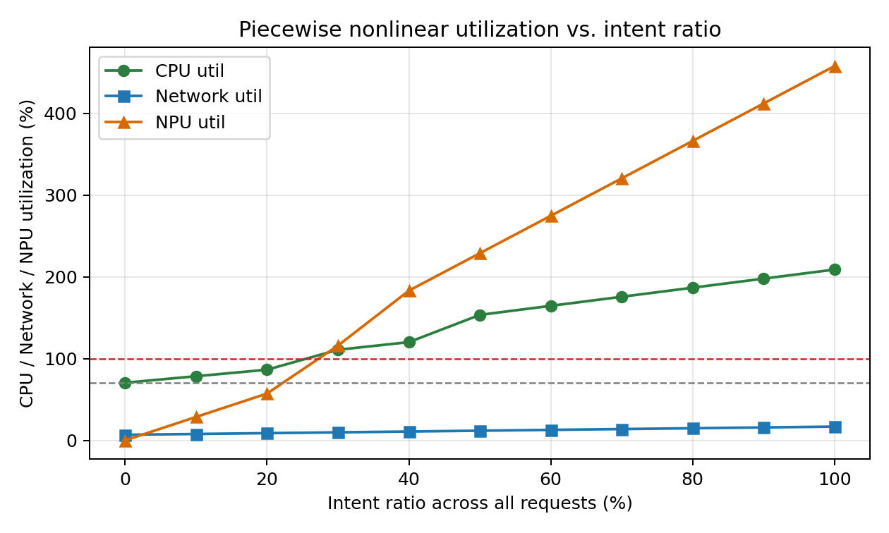
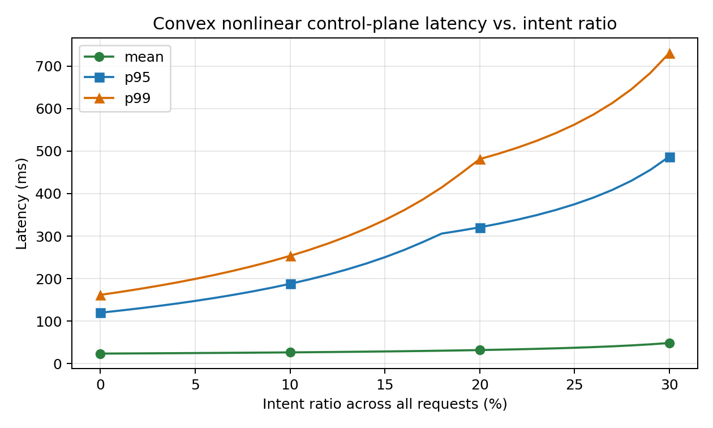
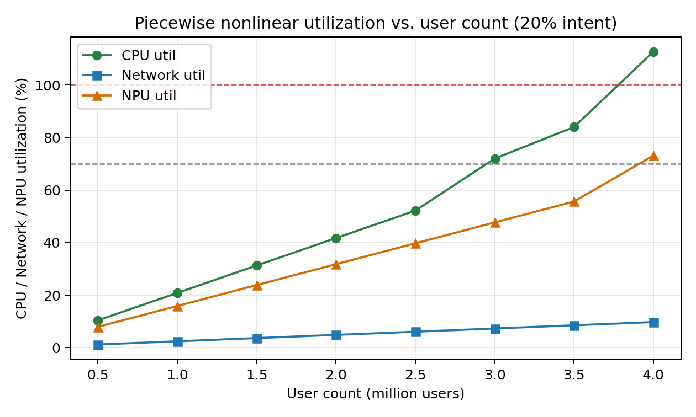

# Analytical Resource Model for Agentic 6G Core Control-Plane Procedures

[中文版本](agentic_core_resource_model_zh.md)

This document defines an analytical resource model for the proposed agentic 6G core architecture. It estimates deterministic core-network processing, NW-Agent overhead, intent handling, tool invocation, inter-agent cooperation, and Qwen3-30B-A3B inference capacity under high-concurrency control-plane workloads.

Roaming, AF-originated intent, and SRF routing cost are excluded. The model is an analytical capacity model, not a deployment measurement.

## Workload Model

Traffic is derived from user population and per-user event frequency. Let $N_{\mathrm{user}}$ be the number of registered users, and let $f_i$ be how many times one user triggers event $i$ per hour.

$$
\lambda_i = \frac{N_{\mathrm{user}} \cdot f_i}{3600}
$$

$$
\lambda_{\mathrm{total}} = \sum_i \lambda_i
$$

The baseline uses $N_{\mathrm{user}}=3.6\times10^6$ users and $2$ PDU sessions/user. The baseline total is $104,300$ requests/s. Any request type may carry intent, so the intent ratio $\rho_I$ is applied to the full request stream.

| Event | Default per user per hour | Derived request rate | Base latency | Base CPU | Base bandwidth |
| --- | ---: | ---: | ---: | ---: | ---: |
| Initial registration | 0.1 events/user/hour | 100 requests/s | 30 ms | 2.0 CPU-ms/request | 12 KB/request |
| Periodic registration | 0.1 events/user/hour | 100 requests/s | 25 ms | 1.5 CPU-ms/request | 10 KB/request |
| Mobility registration | 7.0 events/user/hour | 7,000 requests/s | 30 ms | 2.0 CPU-ms/request | 12 KB/request |
| Initial PDU session establishment | 1.0 events/user/hour | 1,000 requests/s | 40 ms | 2.5 CPU-ms/request | 16 KB/request |
| PDU session release | 1.0 events/user/hour | 1,000 requests/s | 25 ms | 1.5 CPU-ms/request | 10 KB/request |
| PDU session modification | 2.0 events/user/hour | 2,000 requests/s | 30 ms | 2.0 CPU-ms/request | 12 KB/request |
| Service request | 21.0 events/user/hour | 21,000 requests/s | 20 ms | 1.2 CPU-ms/request | 8 KB/request |
| AN release | 35.0 events/user/hour | 35,000 requests/s | 15 ms | 0.8 CPU-ms/request | 6 KB/request |
| Handover | 23.1 events/user/hour | 23,100 requests/s | 25 ms | 1.8 CPU-ms/request | 12 KB/request |
| Paging | 14.0 events/user/hour | 14,000 requests/s | 12 ms | 0.6 CPU-ms/request | 4 KB/request |

## Resource Parameters

| Parameter | Value |
| --- | ---: |
| Host CPU platform | Kunpeng 920 |
| CPU cluster capacity | 256 CPU cores = 256,000 CPU-ms/s |
| RAM capacity | 256 GB |
| Inference runtime | vLLM Ascend 0.11.0 |
| Intent inference model | Qwen3-30B-A3B |
| Configured NPU cluster for Qwen3 serving | 128 NPUs |
| Qwen3 invocation ratio | 10% of intent requests |
| Qwen3 token profile | 128 input tokens + 4 output tokens = 132 tokens/request |
| Qwen3 token capacity | 15,040 tokens/s/replica |
| Qwen3 tensor parallel size | 4 NPUs/replica |
| Network capacity | 100 Gbps |
| Nonlinear overhead model | Fixed load bands |
| Non-intent agent CPU cost | 0.3 CPU-ms/request |
| Intent agent CPU cost | 2.0 CPU-ms/request |
| Non-intent agent latency | 1 ms/request |
| Intent fixed agent latency | 4 ms/request |
| Qwen3 service time for complex intent | 8 ms/request before queueing |
| Intent extra bandwidth | 12 KB/request |

$CPU\text{-}ms$ means one CPU core occupied for one millisecond. For example, $2\ CPU\text{-}ms/request$ at $100,000$ requests/s consumes $200$ CPU cores.

## Qwen3 Capacity Reference

[GPUStack's Qwen3-30B-A3B on Ascend 910B benchmark](https://docs.gpustack.ai/2.0/performance-lab/qwen3-30b-a3b/910b/) reports `15,040.15 total tokens/s` for `128 input tokens` and `4 output tokens`. The [vLLM-Ascend documentation](https://docs.vllm.ai/projects/ascend/en/v0.18.0/) includes Qwen3-30B-A3B guidance; for 32 GB NPU cards, the model uses tensor parallel size $TP_Q=4$.

$$
\lambda_I = \rho_I \cdot \lambda_{\mathrm{total}}
$$

$$
\lambda_Q = \lambda_I \cdot r_Q
$$

$$
T_Q = \lambda_Q \cdot \left(L_{\mathrm{in}} + L_{\mathrm{out}}\right)
$$

The configured NPU cluster for Qwen3 serving has $N_Q=128$ NPUs. The number of available Qwen3 replicas and token capacity are:

$$
R_{Q,\mathrm{avail}} = \left\lfloor \frac{N_Q}{TP_Q} \right\rfloor
$$

$$
C_Q = R_{Q,\mathrm{avail}} \cdot \mu_Q
$$

## Agentic Cost Model

For non-intent requests, incremental agentic CPU cost is $0.30\ CPU\text{-}ms/request$. For intent-bearing requests, CPU-side agent work is $2.00\ CPU\text{-}ms/request$, excluding Qwen3 inference.

$$
D_{\mathrm{intent,light}} = 4\ \mathrm{ms} + 2\ \mathrm{ms}
$$

$$
D_{Q,\mathrm{service}} = 8\ \mathrm{ms/request}
$$

Intent-bearing requests add $12\ \mathrm{KB/request}$ of control-plane metadata for intent containers, task metadata, tool invocation wrappers, and inter-agent status/tracing metadata.

## Piecewise Nonlinear Load Bands

The model uses fixed operating bands to represent high-load contention. Linear demand is calculated first. The corresponding CPU, network, or Qwen3 serving load then selects one multiplier $M(u)$ from the table below.

| Linear load range | Operating state | Multiplier $M(u)$ |
| ---: | --- | ---: |
| $0\% \le u < 60\%$ | Normal | $1.00$ |
| $60\% \le u < 80\%$ | Busy | $1.15$ |
| $80\% \le u < 90\%$ | High load | $1.35$ |
| $90\% \le u$ | Critical | $1.60$ |

This model is nonlinear because the effective cost changes by operating band instead of increasing with a single constant slope.

### Why Nonlinear Overhead Appears

The nonlinear multiplier represents the reduction of effective serving efficiency under high concurrency, not a change in the semantic workload of each request. In normal operation the model stays equal to the transparent linear baseline. In busy, high-load, and critical operation, each request also consumes capacity through contention, scheduling, memory movement, queueing, and runtime coordination.

| Resource area | Nonlinear factor | Effect represented in the model |
| --- | --- | --- |
| CPU | Scheduler overhead, lock contention, cache misses, memory access delay, serialization/deserialization, and state-store pressure. | Effective CPU-ms/request increases in higher CPU load bands. |
| NPU serving for Qwen3 | Batching inefficiency, request routing, replica scheduling, runtime coordination, cross-replica overhead, and KV/cache memory pressure. | Raw token demand is converted into effective token demand before calculating utilization of the configured NPU cluster. |
| Network | Queueing, buffering, congestion-control behavior, retransmission risk, and additional control-plane coordination. | Effective bandwidth and network delay increase in higher network load bands. |
| Latency | CPU queueing, NPU queueing, network queueing, and tail-latency amplification. | Mean, p95, and p99 latency rise faster as utilization approaches saturation. |

KV/cache memory pressure is important for Qwen3 serving. During high concurrency, active requests keep key-value cache entries, runtime buffers, and scheduling state resident for longer periods. This reduces the effective throughput available for new requests even when the raw token profile per request is unchanged. Therefore, the model does not claim that Qwen3 produces more semantic tokens per request; it uses effective token demand to represent serving-system overhead around the model.

$$
C_{\mathrm{cpu,linear}} = \sum_i \frac{\lambda_i}{\lambda_{\mathrm{total}}} C_{\mathrm{base},i} + s_I C_{\mathrm{agent,intent}} + (1-s_I) C_{\mathrm{agent,nonintent}}
$$

$$
D_{\mathrm{cpu}} = \frac{\lambda_{\mathrm{total}} C_{\mathrm{cpu,linear}} M(u_{\mathrm{cpu,linear}})}{1000}
$$

$$
B_{\mathrm{net}} = \frac{\lambda_{\mathrm{total}} B_{\mathrm{req,linear}} \cdot 8}{1,000,000} \cdot M(u_{\mathrm{net,linear}})
$$

$$
u_{Q,\mathrm{linear}} = \frac{T_Q}{C_Q}
$$

$$
T_{Q,\mathrm{eff}} = T_Q \cdot M(u_{Q,\mathrm{linear}})
$$

$$
u_Q = \frac{T_{Q,\mathrm{eff}}}{C_Q}
$$

Queueing delay is represented by:

$$
D_{\mathrm{queue}} = \frac{S \cdot u}{1-u}, \quad 0 \le u < 1
$$

## Analytical Results

The table fixes the user population, event frequencies, and Qwen3 cluster size, then varies the percentage of all requests that carry intent in constant $10\%$ steps. The visible results use the piecewise nonlinear load-band model.

| Intent ratio | Total intent share | Intent rps | Qwen3 rps | Effective Qwen3 tokens/s | CPU cores | CPU util | Memory traffic | NPU util | Network bandwidth | Mean latency | p95 latency | Status |
| ---: | ---: | ---: | ---: | ---: | ---: | ---: | ---: | ---: | ---: | ---: | ---: | --- |
| 0% | 0.0% | 0 | 0 | 0 | 180.3 | 70.4% | 53.402 Gbps | 0.0% | 6.779 Gbps | 24.6 ms | 141.9 ms | degraded |
| 10% | 10.0% | 10,430 | 1,043 | 137,676 | 200.7 | 78.4% | 90.783 Gbps | 28.6% | 7.780 Gbps | 28.1 ms | 231.8 ms | degraded |
| 20% | 20.0% | 20,860 | 2,086 | 275,352 | 221.1 | 86.4% | 128.164 Gbps | 57.2% | 8.782 Gbps | 35.1 ms | 350.8 ms | high_risk |
| 30% | 30.0% | 31,290 | 3,129 | 557,588 | 283.5 | 110.7% | 165.545 Gbps | 115.9% | 9.783 Gbps | unstable | unstable | unstable |
| 40% | 40.0% | 41,720 | 4,172 | 881,126 | 307.5 | 120.1% | 202.926 Gbps | 183.1% | 10.784 Gbps | unstable | unstable | unstable |
| 50% | 50.0% | 52,150 | 5,215 | 1,101,408 | 392.8 | 153.4% | 240.307 Gbps | 228.8% | 11.786 Gbps | unstable | unstable | unstable |
| 60% | 60.0% | 62,580 | 6,258 | 1,321,690 | 421.1 | 164.5% | 277.688 Gbps | 274.6% | 12.787 Gbps | unstable | unstable | unstable |
| 70% | 70.0% | 73,010 | 7,301 | 1,541,971 | 449.5 | 175.6% | 315.069 Gbps | 320.4% | 13.788 Gbps | unstable | unstable | unstable |
| 80% | 80.0% | 83,440 | 8,344 | 1,762,253 | 477.9 | 186.7% | 352.451 Gbps | 366.2% | 14.789 Gbps | unstable | unstable | unstable |
| 90% | 90.0% | 93,870 | 9,387 | 1,982,534 | 506.2 | 197.7% | 389.832 Gbps | 411.9% | 15.791 Gbps | unstable | unstable | unstable |
| 100% | 100.0% | 104,300 | 10,430 | 2,202,816 | 534.6 | 208.8% | 427.213 Gbps | 457.7% | 16.792 Gbps | unstable | unstable | unstable |

Generated results are available in `outputs/agentic_resource_results.csv`. The user-count sensitivity sweep is available in `outputs/agentic_resource_sensitivity.csv`. The Qwen3 sensitivity sweep is available in `outputs/agentic_qwen3_sizing_sensitivity.csv`.

The following user-count sensitivity figure fixes the intent ratio at $20\%$ and varies the user population from $0.5$ million to $4.0$ million users.

## Interpretation

With $128$ configured NPUs assigned to Qwen3 serving and $10\%$ Qwen3 invocation ratio, NPU utilization is $28.6\%$ at $10\%$ intent ratio and $57.2\%$ at $20\%$ intent ratio. At $30\%$ intent ratio, NPU utilization exceeds $100\%$, so the fixed NPU cluster is overloaded. Higher intent ratios require more NPU capacity, lower Qwen3 invocation ratio, shorter token profiles, faster serving, or admission control.

## Model Boundary

The numerical values are analytical input parameters for capacity and sensitivity analysis. Actual deployment results depend on model size, batching behavior, inference hardware, NF implementation, database access latency, message encoding, tool granularity, and operator policy logic. Measured deployment data can be used to calibrate CPU time, inference latency, memory traffic, message size, and queueing behavior.
