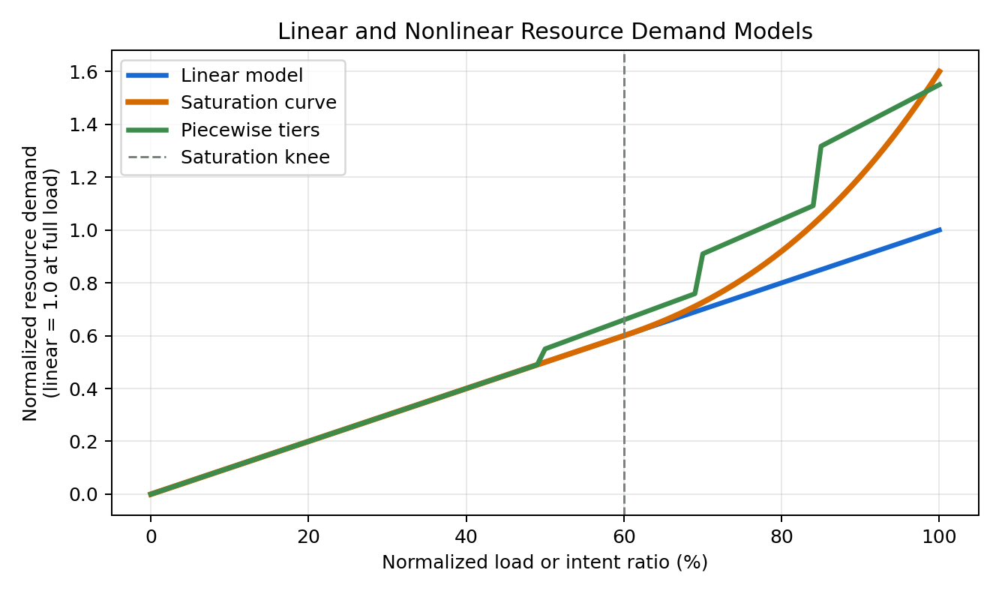

# Nonlinear Model Options for Resource Analysis

This document compares candidate extensions for modeling non-linear resource growth in the agentic 6G core resource model. The selected model for the analytical report and web calculator is Option 4, the smooth convex overhead model.



## Purpose

The current model uses constant per-request CPU cost and constant Qwen3 token cost. This produces resource demand that increases approximately linearly with intent ratio. A deployed product may show curved growth because the per-request cost can increase under high load.

Typical sources of non-linearity include:

| Resource area | Non-linear factor |
| --- | --- |
| CPU | Cache misses, lock contention, scheduler overhead, state-store pressure, and serialization overhead. |
| NPU serving | Batching inefficiency, request routing, replica scheduling, KV/cache pressure, runtime coordination, and cross-replica overhead. |
| Latency | Direct processing-time growth from agent logic and optional Qwen3 service time. Queueing is excluded from the primary model. |

## Option 1: Linear Model

The linear model keeps per-request and per-token cost constant.

```text
D_linear = L
```

Where:

```text
L = normalized load or intent ratio, from 0 to 1
D_linear = normalized resource demand
```

This option is simple and transparent. It is suitable for a first-order capacity estimate, but it does not represent high-load efficiency loss.

## Option 2: Saturation Curve

The saturation curve keeps demand close to linear at low load and gradually increases the cost multiplier after a defined knee point.

```text
F_sat(L) = 1 + alpha * max(0, (L - knee) / (1 - knee))^power

D_sat = L * F_sat(L)
```

Example parameters used in the figure:

| Parameter | Value | Meaning |
| --- | ---: | --- |
| `knee` | 0.60 | Non-linear overhead starts after 60% normalized load. |
| `alpha` | 0.60 | Full-load overhead reaches 60% above the linear model. |
| `power` | 2.0 | Overhead grows smoothly after the knee. |

This option is smooth and suitable for report figures. It represents gradual efficiency loss caused by contention, memory pressure, and serving overhead.

For CPU:

```text
C_cpu,effective = C_cpu,linear * F_cpu(u_cpu)
```

For Qwen3/NPU sizing:

```text
T_Q,effective = T_Q,raw * F_qwen3(load_Q)

Required NPUs =
  ceil(T_Q,effective / (tokens_per_replica * target_utilization))
  * tensor_parallel_size
```

In this interpretation, the NPU hardware capacity is unchanged. The multiplier represents serving-system overhead around the model.

## Option 3: Piecewise Tiers

The piecewise model assigns a fixed multiplier for each load region.

```text
F_piecewise(L) =
  1.00, if L < 0.60
  1.15, if 0.60 <= L < 0.80
  1.35, if 0.80 <= L < 0.90
  1.60, if L >= 0.90

D_piecewise = L * F_piecewise(L)
```

This option is easy to explain verbally: normal, busy, high-load, and critical operation each have one defined multiplier. It is less smooth than the saturation curve and introduces visible changes at tier boundaries.

## Option 4: Smooth Convex Curve

The selected model uses a compact convex function:

```text
F_convex(L) = L + alpha * L^2
```

Example parameter used in the report:

| Parameter | Value | Meaning |
| --- | ---: | --- |
| `alpha` | 0.15 | Additional contention overhead as normalized load grows. |

This option is selected because it has no artificial tier boundaries, produces visible curvature, and remains simple enough to explain in one equation.

## Comparison

| Option | Strength | Limitation | Best use |
| --- | --- | --- | --- |
| Linear | Most transparent and easiest to reproduce. | Understates high-load overhead. | Baseline capacity model. |
| Saturation curve | Smooth and close to real performance degradation. | Requires selecting `knee`, `alpha`, and `power`. | Official report figure and sensitivity analysis. |
| Piecewise tiers | Easy to explain with load bands. | Tier boundaries are artificial. | Operational explanation only. |
| Smooth convex curve | Smooth, compact, and visibly nonlinear. | Requires calibrating `alpha` with deployment data. | Selected model for the report and calculator. |

## Selection Criteria

The final model should be selected based on the intended message:

| Goal | Recommended option |
| --- | --- |
| Keep the paper conservative and simple. | Linear model |
| Show realistic high-load curvature while keeping formulas compact. | Saturation curve |
| Explain operational bands to non-technical reviewers. | Piecewise tiers |
| Avoid artificial bend points while keeping the formula easy. | Smooth convex curve |

For the agentic core resource paper, the selected model is the smooth convex curve because it avoids artificial slope-change points while still showing nonlinear high-load behavior.
